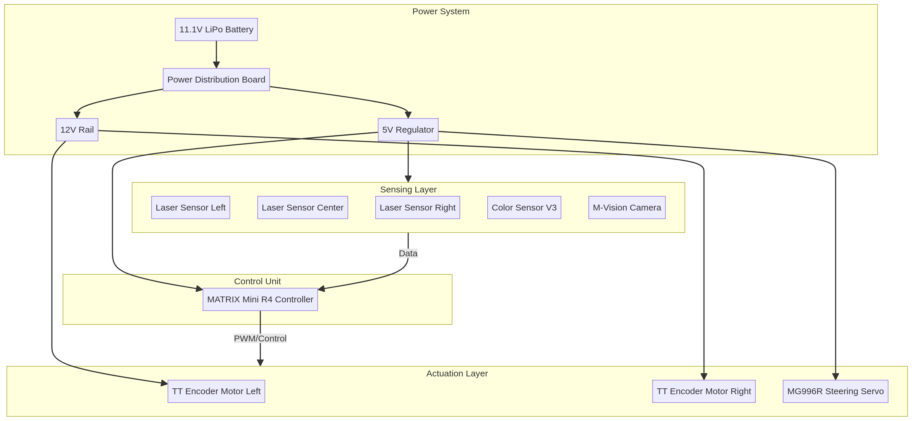
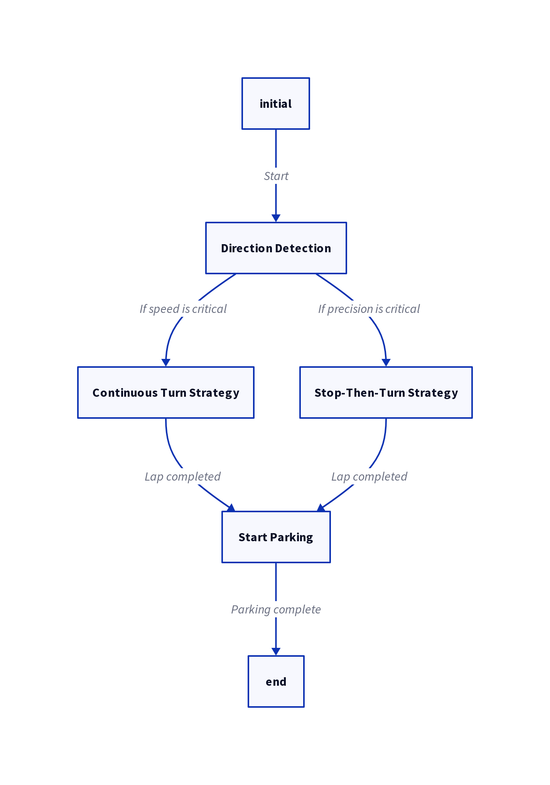
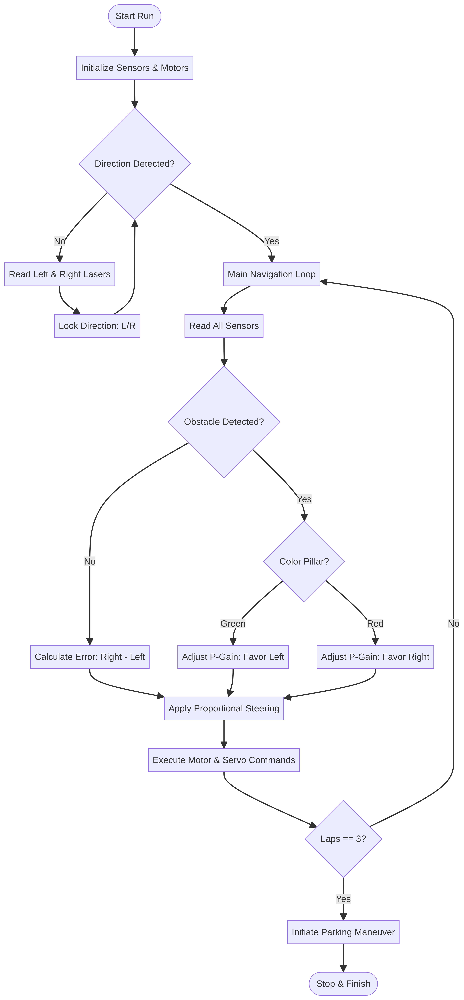

# 🚀 WRO Future Engineers 2026 – Team KCST1: Blaze Autonomous Robot

## ✨ Unleashing Blaze: Precision, Speed, and Innovation in Autonomous Robotics

Welcome to the official repository for **Blaze**, our cutting-edge autonomous robot designed and developed for the **World Robot Olympiad (WRO) 2026 – Future Engineers category**. Blaze is not just a robot; it's a testament to meticulous engineering, innovative problem-solving, and relentless pursuit of excellence. Our mission: to achieve **unparalleled robust, repeatable, and stable navigation** within a dynamic arena, powered by a sophisticated blend of laser-based environmental sensing, advanced steering control, and deterministic decision-making algorithms.

### Why "Blaze"?

Our robot's name, **Blaze**, encapsulates its core attributes and our team's aspirations:

*   🔥 **Blazing Speed:** Fast and decisive movement across the competition track.
*   🔥 **Blazing Performance:** Strong, stable, and consistent execution under pressure.
*   🔥 **Blazing Innovation:** A beacon of engineering ingenuity, pushing the boundaries of autonomous navigation.

Blaze is the culmination of countless hours of iterative design, rigorous testing, and continuous refinement, integrating state-of-the-art mechanical improvements, optimized sensor fusion, and intelligent control logic to deliver a truly competition-winning performance.

## 👥 Meet the Innovators: Team KCST1

<div align="center">

<table>
<tr>
<td align="center">


**Sara**  
*Hardware Design, Mechanical Integration, GitHub Management*

</td>

<td align="center">


**Abbas**  
*Software Development, Testing, System Validation*

</td>
</tr>
</table>

</div>

---

### 👩‍🏫 Our Guiding Light: Coach Eng. Zainab

We extend our deepest gratitude to Eng. Zainab, whose invaluable guidance, unwavering support, and insightful feedback were instrumental in shaping Blaze into the formidable machine it is today.

### Team


---

## 🎥 Witness Blaze in Action: Demonstration Video

Experience Blaze's autonomous capabilities firsthand:

👉 [WRO Future Engineers 2026 - Team KCST1 Robot Demonstration Video](https://youtu.be/j1B9A54QlEQ )

---

## 🎯 The Engineering Imperative: Blaze's Core Objectives

Our primary engineering objective was to construct a robot capable of:

*   **Autonomous Wall & Corner Navigation:** Seamlessly detecting and navigating complex track layouts.
*   **Stable & Responsive Steering:** Maintaining precise control across varying speeds and terrains.
*   **Consistent Lap Completion:** Reliably finishing multiple laps without human intervention.
*   **High Reliability:** Performing flawlessly under the demanding conditions of real-world competition.

---

## ⚙️ Hardware Architecture: The Foundation of Performance

Blaze's robust hardware architecture is meticulously designed for optimal performance and reliability.

### 🧠 The Brain: MATRIX Mini R4 Controller

<div align="center">

</div>

At the heart of Blaze lies the **MATRIX Mini R4 (MAFI900 kit)**, serving as the central processing unit, orchestrating all sensor inputs and motor outputs with precision.

---

### 📡 The Eyes & Ears: Advanced Sensor System

<div align="center">


</div>

Our sensor suite provides Blaze with comprehensive environmental awareness:

*   **3 × MATRIX Laser Sensor V2:** Strategically positioned for superior reliability and consistency in distance measurement, crucial for accurate wall detection and navigation, regardless of lighting conditions.
*   **MATRIX Color Sensor V3:** Utilized for initial track detection and identifying specific colored markers, ensuring precise alignment.
*   **M-Vision Camera (MS-010):** Provides broader environmental awareness, enabling advanced decision-making for obstacle recognition and path planning.

✔ Laser sensors chosen for reliability and consistency.

---

### ⚡ The Muscles: Actuation System

<div align="center">


</div>

*   **TT Encoder Motors (x2):** Deliver precise control over wheel rotation and speed, essential for accurate steering and consistent movement.
*   **MG996R Servo Motor:** Provides high torque and rapid response for dynamic steering adjustments.

---

### 🛞 The Grip: Optimized Wheel System

<div align="center">

</div>

*   **MATRIX TT Wheels:** Selected for their optimal grip and durability on the competition surface. Extensive testing revealed that a uniform wheel system significantly improves stability and predictability compared to mixed configurations.

✔ Improved stability after replacing mixed wheels.

---

### 🔧 Mechanical Innovation: The Custom 3D Printed Axle

<div align="center">


</div>

#### The Challenge:

Early prototypes struggled with a loose axle, leading to unstable steering and compromised accuracy during turns, severely impacting lap times and overall performance.

#### The Breakthrough Solution:

We engineered and implemented a **custom 3D printed axle**. This innovative design provides a secure and precise fit, eliminating play and dramatically enhancing steering stability and control. The CAD files for this critical component are available in the `mechanical/CAD` directory, ensuring full reproducibility.

✔ Result: A significant leap in steering precision and stability, directly translating to improved navigation and reduced error rates.

---

## 💡 System Architecture Overview

This diagram illustrates the interconnectedness of Blaze's subsystems, from power distribution to sensing and actuation.

<div align="center">
  
</div>

---

## 🧭 Navigation System Design: From Challenge to Precision

### ❌ The Initial Detour: Color-Based Navigation

<div align="center">


</div>

Our initial exploration into color-based navigation revealed critical limitations:

*   **Frequent Missed Detections:** Inconsistent recognition of track lines and obstacles, especially at higher speeds.
*   **Lighting Sensitivity:** Performance heavily reliant on ambient light, leading to unpredictable behavior across different environments.
*   **Inconsistent Runs:** High variability in detection resulted in unreliable lap completions.

---


### ✅ The Optimal Path: Laser-Based Navigation

Learning from these challenges, we pivoted to a laser-based system, offering decisive advantages:

*   **Unwavering Reliability:** Consistent and accurate distance readings, independent of surface color or texture.
*   **Environmental Robustness:** Stable operation across diverse lighting conditions, ensuring predictable performance.
*   **Repeatable Precision:** Eliminates variability, leading to highly predictable and repeatable robot behavior.


---


### 🔁 The Direction Locking Strategy

To prevent oscillation and ensure smooth, efficient navigation, we implemented a sophisticated direction locking strategy:

*   The robot's initial turn in any section establishes its intended direction of travel.
*   All subsequent turns within that section are then constrained to follow this established direction.

✔ Result: This strategy effectively eliminates confusion and oscillation, contributing to exceptionally smooth and efficient navigation.


---


## 💻 Software Architecture: The Brains Behind the Blaze

Blaze's software architecture is designed for modularity, flexibility, and robust decision-making, utilizing a state machine approach for clear control flow.

### Software State Machine Diagram

This diagram visualizes the robot's operational states and transitions, providing a clear understanding of its decision-making process.

<div align="center">
  
</div>

### Navigation Logic Flowchart

This flowchart details the decision-making process for Blaze's navigation, including sensor checks and obstacle handling.

<div align="center">
  
</div>

### Navigation Strategies: Speed vs. Precision

We developed and implemented two distinct navigation strategies, offering tactical flexibility:
*   **🅰️ Stop-Then-Turn Strategy:**
    *   **Description:** The robot comes to a complete stop before executing a turn, prioritizing accuracy and control.
    *   **Advantages:** High accuracy, minimal overshoot, precise positioning.
    *   **Disadvantages:** Slower overall speed due to frequent stops.

*   **🅱️ Continuous Turn Strategy:**
    *   **Description:** The robot executes turns while maintaining continuous forward motion, prioritizing speed.
    *   **Advantages:** Faster lap times due to uninterrupted movement.
    *   **Disadvantages:** May exhibit slight drift or wider turning radius, potentially impacting precision.

Both strategies are available in the `src/` folder, allowing the team to select the optimal approach based on specific competition challenges and desired performance characteristics.


---

### 🎯 Final Strategy
Both approaches kept for flexibility during competition  

---


## 💻 Source Code

The complete implementation is available in the `src/` folder.

The final code used for the Open Challenge is:

```text
open_challenge_final_pid_wall_following.ino

Example logic:

if (clockwiseMode)
{
    // Follow left wall
}
else
{
    // Follow right wall
}
```
---

## 🧪 Testing & Validation

<div align="center">
  
  
</div>

- Built a custom home arena  
- Simulated competition conditions  

✔ Enabled continuous testing

---

## 🏎️ Final Robot Design

<div align="center">
  
  
</div>

### 🏷️ Robot Name: Blaze

The final system is officially named **Blaze**, representing the robot’s ability to navigate quickly and reliably while maintaining control and stability.

### Key Improvements:
- Uniform wheel system  
- Custom 3D printed axle  
- Optimized sensor placement  
- Stable chassis design  

✔ Achieved balance between **speed, stability, and reliability**

---

## 📁 Repository Structure: Your Guide to Blaze

Our GitHub repository is organized to provide a clear and complete overview of the project:

- `engineering_journal/` – Detailed documentation of the engineering process, design decisions, and iterations  
- `hardware/` – Electronic components, specifications, and power system  
- `mechanical/` – CAD files, 3D printed parts, and mechanical design  
- `schemes/` – System block diagrams and wiring diagrams  
- `software/` – Software architecture and algorithm explanations  
- `src/` – Source code for the robot  
- `testing/` – Testing procedures, results, and validation  
- `t-photos/` – Team photos  
- `v-photos/` – Robot photos and design evolution  
- `video/` – Demonstration video links  

Each folder is structured to reflect a specific aspect of the engineering workflow, making it easy to understand how Blaze was designed, built, and validated.

---

## 🏁 Engineering Summary

- Iterative design improvements  
- Hardware and software optimization  
- Real-world testing validation  

---

## 🧾 Final Note

The robot achieves **stable, repeatable, and reliable autonomous navigation**, meeting WRO requirements while demonstrating strong engineering principles.

## 📚 References

[1] World Robot Olympiad. (2026). *WRO 2026 Future Engineers – Self-Driving Cars General Rules.*
