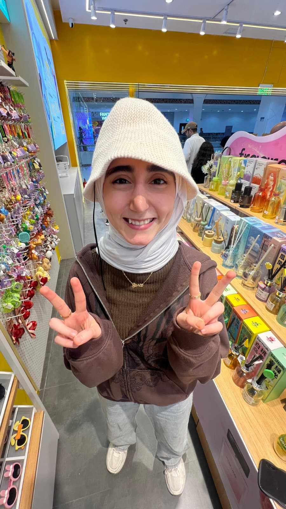
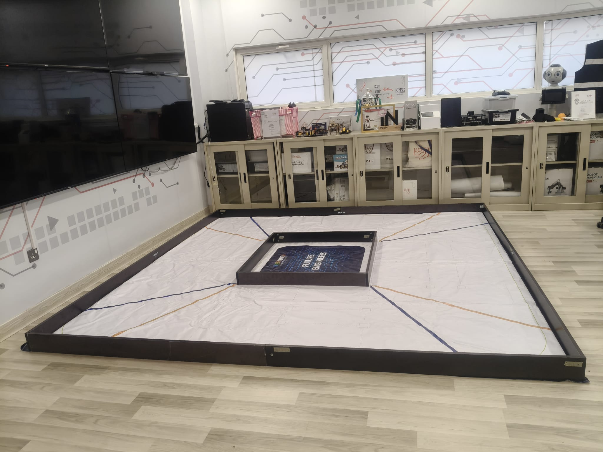

# 🤖 WRO Future Engineers 2026 – KCST1  

## 🚀 Blaze – Autonomous Self-Driving Robot

This repository presents the full design, development, and validation of **Blaze**, our autonomous robot developed for the **World Robot Olympiad (WRO) 2026 – Future Engineers category**.

Blaze is designed to achieve **robust, repeatable, and stable navigation** within a closed arena using a combination of:
- Laser-based environmental sensing  
- Steering-based motion control  
- Deterministic decision-making algorithms  

---

## 🔥 About Blaze

**Blaze** represents speed, precision, and reliability — the core principles behind our robot design.

The name reflects:
- 🔥 Fast and decisive movement  
- 🔥 Strong and stable performance under pressure  
- 🔥 Consistent execution across multiple runs  

Blaze was engineered through multiple iterations, combining **mechanical improvements, sensor optimization, and refined control logic** to achieve competition-level performance.

---

## 👥 Team Members

<div align="center">

<table>
<tr>
<td align="center">



**Sara**  
*Hardware Design, Mechanical Integration, GitHub Management*

</td>

<td align="center">


**Abbas**  
*Software Development, Testing, System Validation*

</td>
</tr>
</table>

</div>

---

### 👩‍🏫 Coach
- Eng. Zainab  

We would like to express our sincere appreciation to our coach for her guidance, support, and continuous feedback throughout the development of this project.

---

### Team


---

## 🎥 Demonstration Video
👉 https://youtu.be/j1B9A54QlEQ  

---

## 🧠 Engineering Objective

The primary objective was to develop a robot capable of:

- Autonomous wall detection and corner navigation  
- Stable steering under varying speeds  
- Consistent lap completion without external input  
- High reliability under real competition conditions  

---

## 🔧 Hardware Architecture

### 🧠 Controller

<div align="center">

</div>

- MATRIX Mini R4 (MAFI900 kit)  

---

### 📡 Sensor System

<div align="center">


</div>

- **3 × MATRIX Laser Sensor V2**
- **MATRIX Color Sensor V3**
- **M-Vision Camera (MS-010)**  

✔ Laser sensors chosen for reliability and consistency  

---

### ⚙️ Actuation System

<div align="center">


</div>

- TT Encoder Motor  
- MG996R Servo Motor  

---

### 🛞 Wheel System

<div align="center">

</div>

- MATRIX TT Wheels  

✔ Improved stability after replacing mixed wheels  

---

### 🔧 Mechanical Innovation – Custom Axle

<div align="center">


</div>

#### Problem:
Loose axle → unstable steering  

#### Solution:
Custom 3D printed axle  

✔ Result: precise steering and stability  

---

## 🧭 Navigation System Design

### ❌ Initial Approach – Color-Based Navigation

<div align="center">


</div>

Issues:
- Missed detections  
- Lighting sensitivity  
- Inconsistent runs  

---

### ✅ Final Approach – Laser-Based Navigation

✔ Reliable  
✔ Consistent  
✔ Independent of lighting  

---

### 🔁 Direction Locking Strategy

- First turn decides direction  
- All future turns follow same direction  

✔ Prevents oscillation  

---

## 💻 Software Architecture

### 🅰️ Stop-Then-Turn
- High accuracy  
- Slower  

### 🅱️ Continuous Turn
- Faster  
- Slight drift  

---

### 🎯 Final Strategy
Both approaches kept for flexibility during competition  

---

## 💻 Source Code

The complete implementation is available in the `src/` folder.

The final code used for the Open Challenge is:

```text
open_challenge_final_pid_wall_following.ino

Example logic:

if (clockwiseMode)
{
    // Follow left wall
}
else
{
    // Follow right wall
}
```
---

## 🧪 Testing & Validation

<div align="center">
  
  
</div>

- Built a custom home arena  
- Simulated competition conditions  

✔ Enabled continuous testing

---

## 🏎️ Final Robot Design

<div align="center">
  
  
</div>

### 🏷️ Robot Name: Blaze

The final system is officially named **Blaze**, representing the robot’s ability to navigate quickly and reliably while maintaining control and stability.

### Key Improvements:
- Uniform wheel system  
- Custom 3D printed axle  
- Optimized sensor placement  
- Stable chassis design  

✔ Achieved balance between **speed, stability, and reliability**

---

## 📁 Repository Structure

- `engineering_journal/`
- `hardware/`
- `mechanical/`
- `software/`
- `src/`
- `testing/`
- `t-photos/`
- `v-photos/`
- `video/`

---

## 🏁 Engineering Summary

- Iterative design improvements  
- Hardware and software optimization  
- Real-world testing validation  

---

## 🧾 Final Note

The robot achieves **stable, repeatable, and reliable autonomous navigation**, meeting WRO requirements while demonstrating strong engineering principles.
