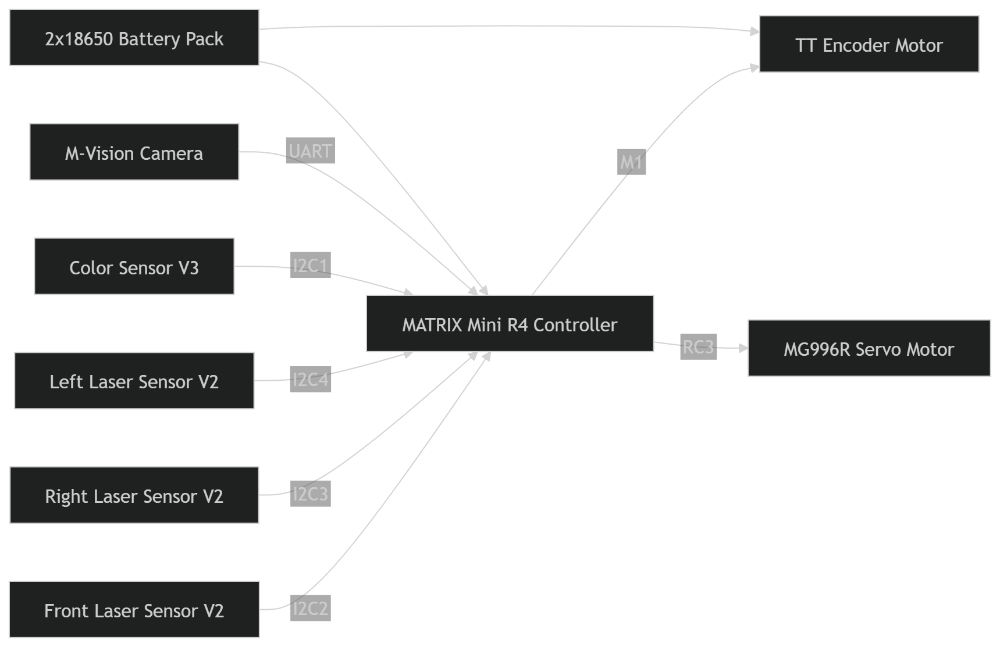

# 🧠 System Block Diagram

This diagram illustrates the **high-level architecture** of the robot and how all major components interact with the central controller.

---

## 📊 Diagram

---

## 🔍 Description

The system is centered around the **MATRIX Mini R4 Controller**, which acts as the main processing unit.

### 🧩 Input Components
The controller receives data from multiple sensors:

- **Front Laser Sensor V2 (I2C2)**  
  Detects obstacles directly ahead

- **Left Laser Sensor V2 (I2C4)**  
  Measures distance from the left wall

- **Right Laser Sensor V2 (I2C3)**  
  Measures distance from the right wall

- **Color Sensor V3 (I2C1)**  
  Detects floor colors (blue/orange) for navigation logic

- **M-Vision Camera (UART)**  
  Used during development for object detection experiments

---

### ⚙️ Output Components

The controller processes sensor data and controls actuators:

- **TT Encoder Motor (M1)**  
  Provides forward motion and speed control

- **MG996R Servo Motor (RC3)**  
  Controls steering direction

---

### 🔋 Power System

- **2x18650 Battery Pack**  
  Supplies power to the controller and all connected components

---

## 🎯 Purpose

This diagram shows the **logical flow of data and control**, helping to understand:

- How sensor data is collected  
- How decisions are made  
- How motion is executed  

---

## ✅ Summary

The system follows a simple but effective structure:

**Sensors → Controller → Decision Logic → Actuators**

This design ensures:
- Fast response time  
- Reliable navigation  
- Clear separation between sensing and control  
